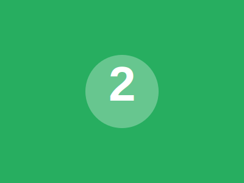
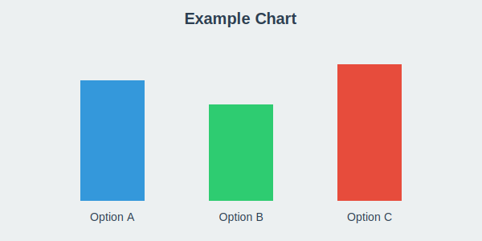

<!-- _class: section-break -->

# Your Presentation Title

**Subtitle or Context**


**Your Name**
**Organization / Event**
**Date**

<!--
Speaker notes: Welcome introduction (30 seconds)
- State your name and role
- Brief context for this presentation
- Set expectations for what audience will learn

REPLACE placeholder image: source/images/placeholder-logo.svg → your-logo.png
-->

---

# Agenda

**Three-Part Structure:**

1. **Introduction**
   - Background and motivation
   - Problem statement

2. **Main Content**
   - Key topic area 1
   - Key topic area 2
   - Key topic area 3

3. **Conclusion**
   - Summary of key points
   - Next steps and recommendations

<!--
Speaker notes: Roadmap overview (30 seconds)
- Walk through agenda quickly
- Mention estimated time for each section
- Set expectations for Q&A (end or throughout)
-->

---

# Background

**Context:** What problem are you solving?

**Current Situation:**
- Pain point or gap in existing approach
- Why this topic matters
- Who is affected

**Objective:**
- Clear goal statement
- Success criteria
- Expected outcomes

> **TAKEAWAY:** One-sentence summary of why this presentation matters

<!--
Speaker notes: Set the stage (60 seconds)
- Explain the business/technical context
- Connect to audience's interests
- Transition to problem statement
-->

---

<!-- _class: section-break -->

# Part 1: Main Content


<!--
Speaker notes: Section transition (10 seconds)
- Brief pause for context switch
- Introduce what's coming in this section
-->

---

# Topic 1: Example Content Slide

**Key Point:** Your main message for this slide

**Supporting Details:**
- Bullet point 1 with key information
- Bullet point 2 with evidence or data
- Bullet point 3 with implications

**Visual Example:**
```python
# Code blocks are supported
def example_function():
    return "Syntax highlighting works!"
```

> **TAKEAWAY:** One key insight from this slide

<!--
Speaker notes: Main point explanation (60 seconds)
- Elaborate on key point
- Walk through bullets
- Explain code example if relevant
-->

---

# Topic 2: Tables & Data

**Comparison Example:**

| Feature | Option A | Option B | Option C |
|---------|----------|----------|----------|
| **Cost** | Low ($X) | Medium ($Y) | High ($Z) |
| **Timeline** | Fast | Moderate | Slow |
| **Complexity** | Simple | Medium | Complex |
| **Risk** | Low | Medium | High |

**Analysis:**
- Option A best for cost-constrained projects
- Option B balanced approach
- Option C when quality is paramount

> **TAKEAWAY:** No single "best" solution - depends on priorities

<!--
Speaker notes: Trade-off discussion (60 seconds)
- Walk through comparison criteria
- Explain why each option has merits
- Emphasize context-dependent decision making
-->

---

# Topic 3: Key Findings

**Main Results:**

1. **Finding #1:** [Description of first key result]
   - Supporting data point
   - Impact or implication

2. **Finding #2:** [Description of second key result]
   - Supporting data point
   - Impact or implication

3. **Finding #3:** [Description of third key result]
   - Supporting data point
   - Impact or implication

> **TAKEAWAY:** These findings demonstrate [core message]

<!--
Speaker notes: Results summary (60 seconds)
- Present findings clearly
- Connect to original problem
- Highlight most significant result
-->

---

<!-- _class: section-break -->

# Part 2: Next Topic Area



<!--
Speaker notes: Transition to next section (10 seconds)
- Connect previous section to this one
- Preview what's coming
-->

---

# Additional Topic

**Concept Overview:**

Your explanation of the next major topic area. Use this space to:
- Define key terms
- Introduce new concepts
- Build on previous sections

**Why This Matters:**
- Connection to overall objective
- Practical implications
- Real-world applications

<!--
Speaker notes: Concept introduction (60 seconds)
- Explain at appropriate technical level for audience
- Use analogies if helpful
- Check for understanding (if interactive presentation)
-->

---

# Summary & Conclusion

**What We Covered:**
- ✅ Key point #1 from introduction
- ✅ Key point #2 from main content
- ✅ Key point #3 from analysis

**Key Insights:**
- Primary takeaway message
- Secondary important finding
- Actionable recommendation

**Next Steps:**
- Immediate action item
- Short-term milestone
- Long-term goal

> **TAKEAWAY:** [Your final key message in one sentence]

<!--
Speaker notes: Wrap-up (60 seconds)
- Reinforce main points
- Call to action if applicable
- Transition to Q&A
-->

---

# Questions?

**Contact Information:**
- Email: your.email@example.com
- GitHub: github.com/yourusername
- LinkedIn: linkedin.com/in/yourprofile

**Resources:**
- Slides: [link to presentation]
- Code/Data: [link to repository]
- Documentation: [link to docs]

> **Thank you for your attention!**

<!--
Speaker notes: Q&A preparation
- Pause for questions
- Be ready to jump to backup slides if needed
- Common anticipated questions: [list them here]
-->

---

<!-- _class: section-break -->

# BACKUP SLIDES


**Additional Details & Examples**

*Only show if asked during Q&A*

<!--
Speaker notes: Backup section
- Don't present these unless asked
- Know this content cold for Q&A
- Use as reference during questions
-->

---

# Backup: Advanced Tables

**Complex data formatting example:**

| Metric | Q1 2025 | Q2 2025 | Q3 2025 | YoY Change |
|--------|---------|---------|---------|------------|
| **Revenue** | $1.2M | $1.5M | $1.8M | +15% |
| **Costs** | $800K | $900K | $950K | +8% |
| **Margin** | 33% | 40% | 47% | +12 pts |

**Features Demonstrated:**
- Bold column headers with color
- Alternating row colors for readability
- Numeric data alignment
- Currency and percentage formatting

<!-- Only show if asked about detailed financial breakdown -->

---

# Backup: Code Examples

**Syntax highlighting for multiple languages:**

Python:
```python
def calculate_total(items):
    return sum(item.price for item in items)
```

JavaScript:
```javascript
const calculateTotal = (items) => {
  return items.reduce((sum, item) => sum + item.price, 0);
};
```

Bash:
```bash
# Generate presentation
make marp
firefox artifacts/presentation-marp.html
```

<!-- Only show if technical implementation details requested -->

---

# Backup: Lists & Formatting

**Nested lists:**
- Top-level item 1
  - Sub-item 1.1
  - Sub-item 1.2
- Top-level item 2
  - Sub-item 2.1
    - Sub-sub-item 2.1.1

**Inline formatting:**
- **Bold text** for emphasis
- *Italic text* for subtle emphasis
- `Code inline` for technical terms
- ~~Strikethrough~~ for deprecated items

**Blockquote with custom styling:**
> This is a **takeaway box** - use for key messages at end of slides

<!-- Formatting reference for building new slides -->

---

# Backup: Image Placement Examples

**Center image (default):**


**Usage in Markdown:**
```markdown

```

**Background images:**
```markdown

```

**Tips:**
- Put images in `source/images/` directory
- Use relative paths for portability
- Supported formats: PNG, JPG, SVG, GIF

<!-- Reference for adding images to new slides -->

---

# Backup: Mathematical Notation

**Simple inline math:** Use Unicode symbols like × ÷ ≤ ≥ ≈ ≠ π

**Complex formulas (LaTeX syntax requires plugin):**

Without plugin, use clear notation:
- Power calculation: P = V × I
- Energy: E = 1/2 × C × V²
- Frequency: f = 1 / T

**Tables for equations:**

| Variable | Value | Unit |
|----------|-------|------|
| Voltage (V) | 5.0 | V |
| Current (I) | 2.5 | A |
| Power (P) | 12.5 | W |

<!-- Technical calculation reference -->

---

# Backup: CSS Customization

**To customize theme, edit YAML frontmatter:**

```yaml
---
style: |
  section {
    font-size: 22px;           /* Smaller text */
    background: #f9f9f9;       /* Light gray background */
  }
  h1 {
    color: #e74c3c;            /* Red headings */
    border-bottom: 3px solid #c0392b;
  }
  blockquote {
    background-color: #fff3cd;  /* Yellow takeaway boxes */
    border-left: 5px solid #ffc107;
  }
---
```

**Color palette used in this template:**
- Blue: `#3498db`, `#2980b9` (primary, headers)
- Gray: `#2c3e50`, `#34495e` (text, dark elements)
- Light: `#ecf0f1`, `#ffffff` (backgrounds)

<!-- Reference for designers/customizers -->

---

# Backup: Workflow Tips

**Recommended iteration cycle:**
```bash
# Terminal 1: Edit slides
vim source/presentation-marp.md

# Terminal 2: Auto-rebuild on save (if using watch mode)
npx @marp-team/marp-cli -w source/presentation-marp.md

# Browser: Refresh to see changes (1 second rebuild!)
```

**Git workflow:**
```bash
git add source/presentation-marp.md
git commit -m "Add section on [topic]"
git push
```

**Before presenting:**
- [ ] Test HTML in target browser
- [ ] Verify all images load
- [ ] Practice with timer
- [ ] Export PDF backup: `make marp`

<!-- Workflow reference for new users -->
